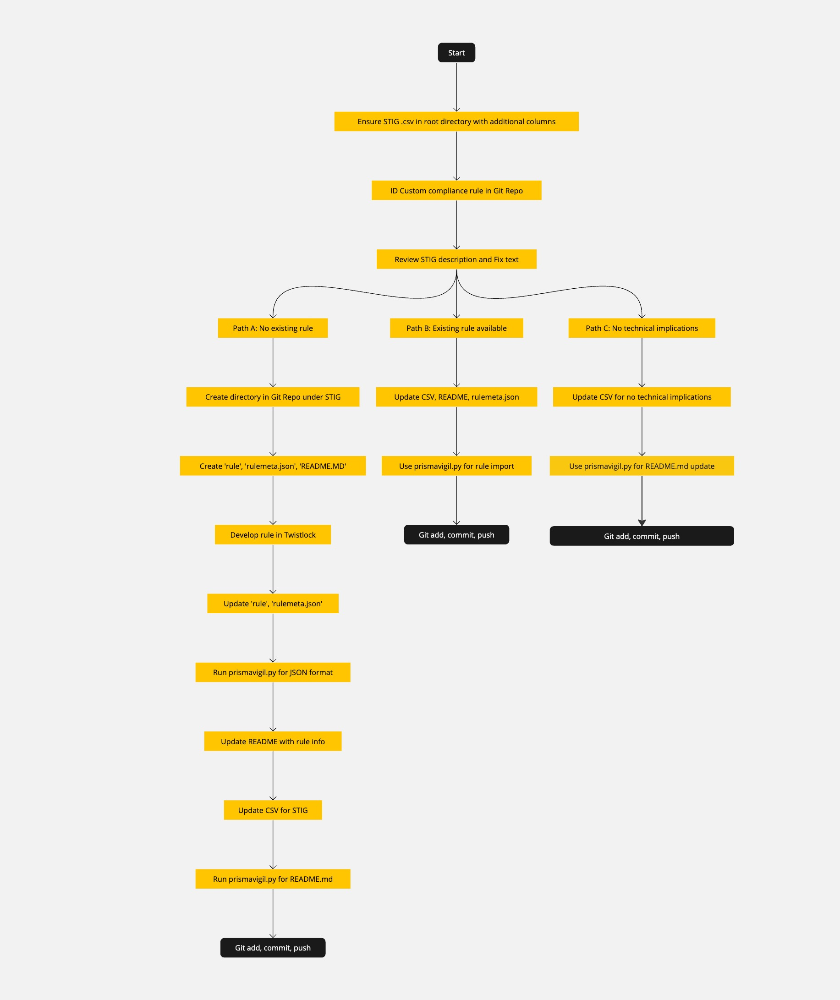

# Development Flow for Prisma Cloud Compute Custom Runtime Rules

## Introduction
This directory is dedicated to the development and collaboration processes specific to Prisma Cloud Compute Custom Runtime Rules within the STIGFUSION-PRISMAVIGIL project. It aims to provide clear guidelines and resources for effectively developing, managing, and collaborating on these custom rules.

## Development Workflow Overview
The development of Custom Runtime Rules in Prisma Cloud Compute involves several key steps:

1. **Rule Conceptualization**: Identifying the security requirements and defining the objectives of the custom runtime rule.
2. **Development**: Writing the rule logic based on Prisma Cloud Compute capabilities.
3. **Testing**: Validating the rule in a controlled environment to ensure it behaves as expected.
4. **Documentation**: Documenting the rule's purpose, logic, and any relevant details.
5. **Collaboration**: Working with team members to review, refine, and approve the rule.
6. **Deployment**: Integrating the rule into the Prisma Cloud Compute environment for active monitoring.

## Collaboration and Version Control
We use Git for version control and collaboration. It is crucial for team members to regularly commit changes and participate in peer reviews through pull requests. This ensures a transparent development process and maintains the integrity of our rule set.

### PrismaVigilFlow Diagram
A visual representation of our development and collaboration process can be found in `PrismaVigilFlow.jpg`. This flowchart is a critical tool for understanding the lifecycle of custom runtime rule development.

## Best Practices for Rule Development
- **Code Consistency**: Follow the established coding standards and naming conventions.
- **Thorough Testing**: Ensure each rule is rigorously tested before deployment.
- **Comprehensive Documentation**: Document the purpose and behavior of each rule for future reference and team understanding.
- **Regular Updates**: Keep rules up-to-date with the latest Prisma Cloud Compute features and security findings.

## Resources
- [Prisma Cloud Compute Documentation](https://docs.prismacloud.io/)

## Contributing
Contributions to our Custom Runtime Rules are welcome. Please adhere to the following steps for contributing:

1. **Fork the Repository**: Create your own fork of the project.
2. **Create a Feature Branch**: Work on your contribution in a separate branch.
3. **Submit a Pull Request**: Once your contribution is ready, submit a pull request for review.

## Feedback and Contact
For any suggestions or discussions regarding the development of Custom Runtime Rules, please reach out to:

- Jonathan Spigler, VP of Operations, jonathan@j2rsolutions.io
- [Other relevant team member's contact information]

## License
The documentation and resources in this directory are provided under [applicable license]. Use at your own risk.

*Part of the STIGFUSION-PRISMAVIGIL project, enhancing security and compliance in Prisma Cloud environments.*
