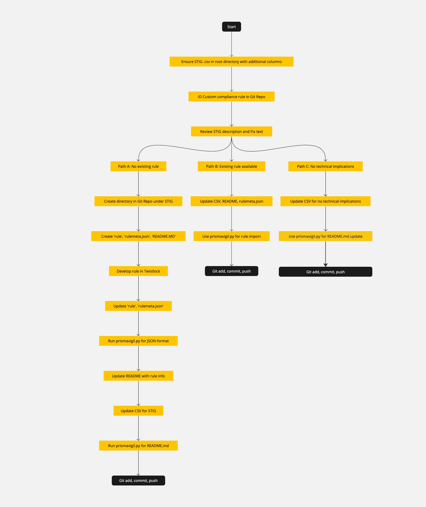

# Development Flow Documentation

## Introduction
Welcome to the `developmentFlow` directory of the STIGFUSION-PRISMAVIGIL project. This section is dedicated to providing detailed documentation on the development processes, including flow diagrams, best practices, and specific methodologies used within our project. Our aim is to offer clear and comprehensive guides to facilitate efficient and effective development workflows.

## Contents
This directory contains various documents and resources that describe our development workflow. Key components include:

- **PrismaVigilFlow.jpg**: A flowchart that visually represents the development process within the context of the Prisma Cloud environment.

## PrismaVigil Development Flow Diagram

This diagram serves as a visual guide to understanding the development flow used in our project. It outlines the stages of development, decision points, and key processes that are integral to our workflow.

## Best Practices
In this section, we document the best practices that our team follows to ensure a smooth and efficient development process. These practices include coding standards, documentation guidelines, and collaboration techniques.

## Methodologies
We employ various methodologies to streamline our development process and ensure compliance with DISA STIG requirements. This section elaborates on the methodologies used, including Agile practices, Continuous Integration/Continuous Deployment (CI/CD), and others.

## Additional Resources
For further reading and resources related to the development process, refer to the following:

- [Prisma Cloud Documentation](https://docs.prismacloud.io/)
- [DISA STIG Guidelines](https://public.cyber.mil/stigs/)

## Contributing
We welcome contributions to this documentation. If you have suggestions or improvements, please follow the standard procedure of making a pull request with your proposed changes.

## Contact
For any queries or discussions regarding the development flow documentation, feel free to reach out to the project maintainers:

- Jonathan Spigler, VP of Operations, jonathan@j2rsolutions.io
- [Other team members/contact information]

## License
This documentation is provided for use under [applicable license], use at your own risk.

*This README is part of the STIGFUSION-PRISMAVIGIL project, dedicated to enhancing security and compliance in Prisma Cloud environments.*

---

This template provides a structured approach to your `developmentFlow` directory's documentation. You can customize it further based on the specific content and resources available in your directory. Remember to add or modify sections to better fit the nature of your project and the information you wish to convey.