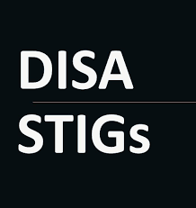

# STIGFUSION-PRISMAVIGIL

## Overview
STIGFUSION-PRISMAVIGIL is a collection of Prisma Cloud Compute custom compliance checks and runtime rules, aimed at supporting development efforts in addressing DISA STIGs. This project focuses on identifying runtime deviations and anomalous activities in development environments.

 ➡️ 

## Project Structure
The project is organized into two primary directories at the root level:

- `scripts`
- `stigs`

### STIGs Directory
Within the `stigs` directory, there are subdirectories for specific STIGs, each containing:

- `custom_compliance_checks`
- `custom_runtime_rules`

#### Custom Compliance Checks
These checks are mapped directly to corresponding DISA STIG rules and are essential for aligning development with compliance standards.

#### Custom Runtime Rules
The runtime rules reference related STIGs and follow the naming format `STIG_{stig_name}_{description_of_rule}`. They are designed to detect runtime events, offering insights into compliance adherence during runtime.

## Python Script for Prisma Cloud API Interaction
An integral part of this project is a Python script designed to interact with the Prisma Cloud API. This script facilitates the loading of custom compliance and runtime rules, and also provides a functionality to convert raw rules into a structured, importable format. Key functionalities include:

- Perform a container scan (`-cs` / `--containerscan`)
- Retrieve custom compliance checks (`-gcc` / `--get_custom_compliance`)
- Update custom compliance rules from a file (`-ucc` / `--updatecustomcompliance`)
- Update custom runtime rules from a file (`-ucr` / `--updatecustomruntimerules`)
- Retrieve custom runtime rules (`-gcr` / `--get_custom_runtime_rules`)
- Convert raw rules into importable format (`-convert` followed by necessary rule details) *(in development)*
- Set the console hostname (`-c` / `--console`)
- Specify the API version, defaulting to 32.00 (`-v` / `--version`)

## Getting Started
To use STIGFUSION-PRISMAVIGIL, clone the repository and navigate through the `scripts` and `stigs` directories. The Python script can be used for efficient interaction with the Prisma Cloud environment, as well as for converting raw rule definitions into a structured format suitable for import.

## Contributing
We encourage contributions that align with the project's goal of supporting development efforts in compliance and security. Please follow the established naming conventions and provide thorough documentation for your contributions.

## License
Opensource use at own risk

*Supporting development efforts in compliance and security monitoring within Prisma Cloud Compute environments.*
